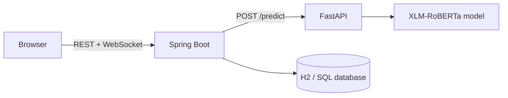

# Real-Time AI Fraud Detection for E-Learning

An end-to-end academic prototype that classifies suspicious e-learning comments in real time. A multilingual XLM-RoBERTa classifier is exposed through FastAPI, consumed by a Spring Boot application, and streamed to the browser over WebSocket.

> This is a decision-support demonstration, not a production moderation system. Predictions can be wrong and must not be used as the sole basis for sanctions or account decisions.

## What this version improves

- separates model training, inference, and the web application;
- keeps private training text and large model weights out of Git;
- removes keyword fallbacks and fabricated confidence scores;
- reports model unavailability instead of silently returning a normal result;
- preserves the multiclass prediction while exposing an explicit risk flag;
- adds validation, safe logging, CORS restrictions, tests, Docker files, and documentation;
- uses duplicate-aware dataset splitting to reduce evaluation leakage.

## Architecture



## Reported experiment

The following values come from the preserved aggregate evaluation report. Raw prediction rows are intentionally excluded because they contain user-generated text.

| Metric | Value |
|---|---:|
| Accuracy | 0.9270 |
| Weighted F1 | 0.9382 |
| Macro F1 | 0.8255 |
| Test examples | 76,605 |

These metrics are historical and are not automatically reproduced by this repository because the private dataset and trained weights are not published. See [the model card](docs/MODEL_CARD.md) for limitations.

## Quick start with Docker

Prerequisites: Docker Desktop and trained model artifacts placed in `ml/models/xlm_roberta_fraud_classifier/`.

```bash
docker compose up --build
```

Open `http://localhost:8080`. The API health endpoints are available at `http://localhost:8000/health` and `/ready`.

If the weights are absent, the AI service stays healthy but `/ready` and `/predict` clearly return an unavailable status. It never invents a prediction.

## Local development

### AI service

```bash
cd ai-service
python -m venv .venv
# Windows: .venv\Scripts\activate
# macOS/Linux: source .venv/bin/activate
pip install -r requirements-dev.txt
uvicorn app.main:app --reload --port 8000
```

### Spring application

```bash
cd spring-backend
mvn spring-boot:run
```

### Prepare, train, and evaluate

```bash
pip install -r ml/requirements.txt
python ml/scripts/prepare_dataset.py --input path/to/private.csv --output-dir ml/data/processed
python ml/scripts/train.py --data-dir ml/data/processed --output-dir ml/models/xlm_roberta_fraud_classifier
python ml/scripts/evaluate.py --data-file ml/data/processed/test.csv --model-dir ml/models/xlm_roberta_fraud_classifier
```

Expected source columns are `text` and `label`. Do not commit the resulting dataset or checkpoints.

For the exact first publication commands and recommended repository topics, see [Publish to GitHub](docs/PUBLISH_TO_GITHUB.md).

## Repository structure

```text
ai-service/       FastAPI inference service
ml/               data preparation, training, evaluation, aggregate metrics
spring-backend/   Spring Boot REST/WebSocket application and browser UI
docs/             architecture, data, deployment, and model documentation
```

## Testing

```bash
python -m pytest ai-service/tests ml/tests
mvn -f spring-backend/pom.xml test
```

## Responsible use and privacy

- Do not commit raw comments, personal data, credentials, or access tokens.
- Redact URLs, email addresses, and phone numbers before training.
- Treat every prediction as a signal that requires human review.
- Monitor errors by language, dialect, and class before any real deployment.

## Project context

This public version is a cleaned continuation of an academic team project. Chaima Menouar worked on cloud integration and model training/evaluation and prepared this maintainable portfolio release. The original private repository contains the initial team history; see [CONTRIBUTORS.md](CONTRIBUTORS.md).

No open-source license has been selected. All rights remain with the contributors unless a license is added later with their agreement.
