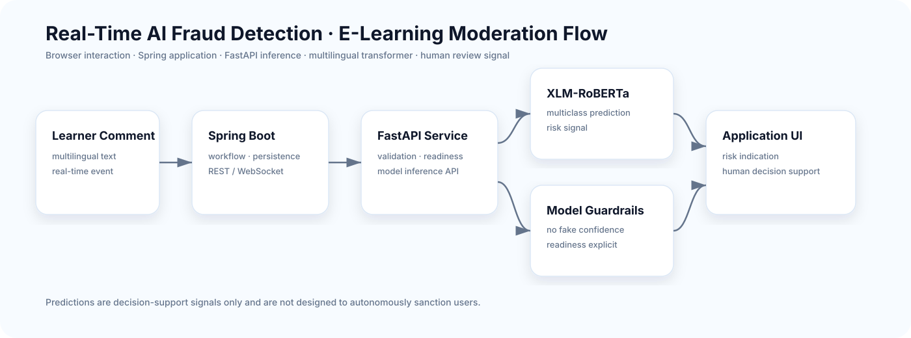

<div align="center">

# Real-Time AI Fraud Detection for E-Learning

### Multilingual risk classification connected to a real-time web application

**XLM-RoBERTa · FastAPI · Spring Boot · REST/WebSocket · Docker · human review**


</div>

An end-to-end academic prototype that classifies suspicious e-learning comments in real time. A multilingual **XLM-RoBERTa** classifier is exposed through FastAPI, consumed by a Spring Boot application and returned to the browser through REST/WebSocket flows.

> Predictions are **decision-support signals**, not a production moderation verdict and never a sufficient basis for sanctions or account decisions.

## Architecture



The application separates the ML inference boundary from the web application: Spring Boot owns workflow and persistence; FastAPI owns validated model inference and readiness.

## Engineering highlights

- model training, inference and web application are separated;
- private training text and large model weights stay outside Git;
- no keyword fallback or fabricated confidence values;
- model unavailability is reported explicitly;
- multiclass outputs remain available while exposing a clear risk signal;
- validation, safer logging, CORS controls, tests and Docker support;
- duplicate-aware splitting reduces evaluation leakage risk.

## Reported experiment

| Metric | Value |
|---|---:|
| Accuracy | 0.9270 |
| Weighted F1 | 0.9382 |
| Macro F1 | 0.8255 |
| Test examples | 76,605 |

These are preserved historical experiment results. The private dataset and model weights are intentionally not published, so the public repository does not claim automatic reproducibility of those exact values.

## Technology stack

`Python` · `FastAPI` · `Hugging Face Transformers` · `XLM-RoBERTa` · `Spring Boot` · `WebSocket` · `H2/SQL` · `Docker Compose` · `Pytest` · `Maven`

## Quick start

Place model artifacts under:

```text
ml/models/xlm_roberta_fraud_classifier/
```

Then run:

```bash
docker compose up --build
```

Open the Spring application at `http://localhost:8080`. The inference service exposes readiness on port `8000`.

If weights are missing, readiness is reported as unavailable instead of inventing a prediction.

## Local development

### AI service

```bash
cd ai-service
python -m venv .venv
# Windows: .venv\Scripts\activate
# macOS/Linux: source .venv/bin/activate
pip install -r requirements-dev.txt
uvicorn app.main:app --reload --port 8000
```

### Spring application

```bash
cd spring-backend
mvn spring-boot:run
```

## Training workflow

```bash
pip install -r ml/requirements.txt
python ml/scripts/prepare_dataset.py --input path/to/private.csv --output-dir ml/data/processed
python ml/scripts/train.py --data-dir ml/data/processed --output-dir ml/models/xlm_roberta_fraud_classifier
python ml/scripts/evaluate.py --data-file ml/data/processed/test.csv --model-dir ml/models/xlm_roberta_fraud_classifier
```

Expected source columns: `text`, `label`.

## Repository structure

```text
ai-service/       FastAPI inference service
ml/               preparation, training, evaluation, aggregate metrics
spring-backend/   Spring Boot app, REST/WebSocket layer and browser UI
docs/             architecture, model and deployment documentation
```

## Testing

```bash
python -m pytest ai-service/tests ml/tests
mvn -f spring-backend/pom.xml test
```

## Responsible use

- never commit raw comments, personal data, credentials or access tokens;
- redact URLs, emails and phone numbers before training;
- require human review for decisions;
- evaluate errors across language, dialect and class before real deployment.

## Project context

This public version is a cleaned continuation of an academic team project. **Chaima Menouar** worked on cloud integration and model training/evaluation and prepared this maintainable portfolio release. See [`CONTRIBUTORS.md`](CONTRIBUTORS.md).
