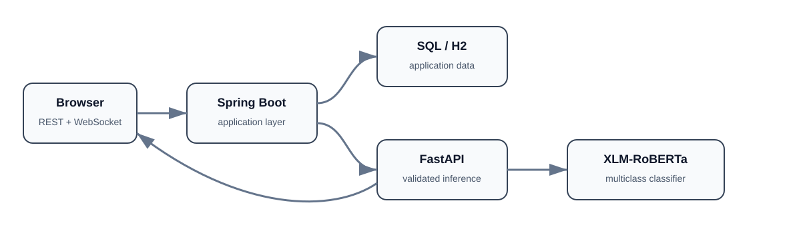

# Real-Time AI Fraud Detection for E-Learning

An end-to-end academic prototype that classifies suspicious e-learning comments in real time. A multilingual **XLM-RoBERTa** classifier is exposed through FastAPI, consumed by a Spring Boot application, and returned to the browser through REST/WebSocket flows.

> This project is a decision-support demonstration, not a production moderation system. Predictions can be wrong and must not be used as the sole basis for sanctions or account decisions.

## Architecture



The application separates the ML inference service from the web application. Spring Boot owns the application workflow and persistence, while FastAPI is responsible for validated model inference.

## Engineering improvements in this release

- separates model training, inference, and the web application;
- keeps private training text and large model weights out of Git;
- removes keyword fallbacks and fabricated confidence values;
- reports model unavailability instead of silently returning a normal result;
- preserves multiclass predictions while exposing a clear risk signal;
- adds validation, safer logging, CORS restrictions, tests, Docker support, and documentation;
- uses duplicate-aware dataset splitting to reduce evaluation leakage.

## Reported experiment

The following values come from the preserved aggregate evaluation report:

| Metric | Value |
|---|---:|
| Accuracy | 0.9270 |
| Weighted F1 | 0.9382 |
| Macro F1 | 0.8255 |
| Test examples | 76,605 |

These are historical experiment results. The private dataset and trained weights are intentionally not published, so the repository does not claim that these values are automatically reproducible from the public files alone.

## Technology stack

- Python
- FastAPI
- Hugging Face Transformers
- XLM-RoBERTa
- Spring Boot
- WebSocket
- H2 / SQL persistence
- Docker / Docker Compose
- Pytest and Maven tests

## Quick start

Model artifacts must be placed under:

```text
ml/models/xlm_roberta_fraud_classifier/
```

Then run:

```bash
docker compose up --build
```

Open the Spring application at `http://localhost:8080`. The inference service exposes health/readiness endpoints on port `8000`.

If the weights are missing, the service stays observable but prediction readiness is reported as unavailable. It does not invent an output.

## Local development

### AI service

```bash
cd ai-service
python -m venv .venv
# Windows: .venv\Scripts\activate
# macOS/Linux: source .venv/bin/activate
pip install -r requirements-dev.txt
uvicorn app.main:app --reload --port 8000
```

### Spring application

```bash
cd spring-backend
mvn spring-boot:run
```

## Training workflow

```bash
pip install -r ml/requirements.txt
python ml/scripts/prepare_dataset.py --input path/to/private.csv --output-dir ml/data/processed
python ml/scripts/train.py --data-dir ml/data/processed --output-dir ml/models/xlm_roberta_fraud_classifier
python ml/scripts/evaluate.py --data-file ml/data/processed/test.csv --model-dir ml/models/xlm_roberta_fraud_classifier
```

Expected source columns are `text` and `label`. Raw comments and checkpoints must remain outside the public repository.

## Repository structure

```text
ai-service/       FastAPI inference service
ml/               preparation, training, evaluation, aggregate metrics
spring-backend/   Spring Boot app, REST/WebSocket layer and browser UI
docs/             architecture, model and deployment documentation
```

## Testing

```bash
python -m pytest ai-service/tests ml/tests
mvn -f spring-backend/pom.xml test
```

## Responsible use and privacy

- never commit raw comments, personal data, credentials, or access tokens;
- redact URLs, email addresses, and phone numbers before training;
- treat predictions as signals requiring human review;
- evaluate errors across language, dialect, and class before any real deployment.

## Project context

This public version is a cleaned continuation of an academic team project. **Chaima Menouar** worked on cloud integration and model training/evaluation and prepared this maintainable portfolio release. See [`CONTRIBUTORS.md`](CONTRIBUTORS.md) for attribution.

No open-source license has been selected. All rights remain with the contributors unless a license is added later with their agreement.
